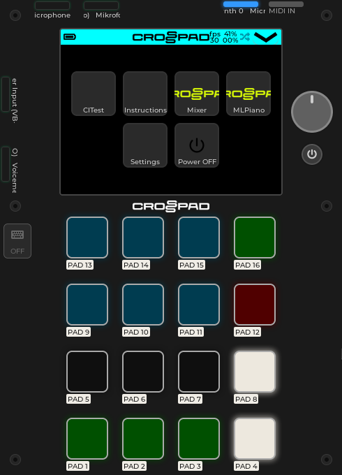
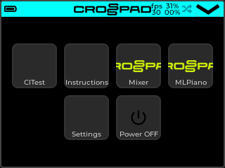
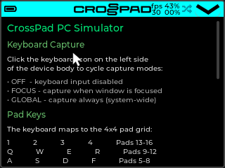

<div align="center">


# 🎛️ CrossPad S3

### An ultra-compact, open-source, hackable sampler — a platform for building your own beat machine.

### *Build it yourself. Play it anywhere. Modify anytime.*

**ESP32-S3 · 16 velocity-sensitive pads · Touch screen · WiFi + BLE · 2000 mAh battery · SD card · Stereo line out · No soldering**

<p>
  <a href="https://crosspad.app">
    
  </a>
  <a href="https://play.crosspad.app">
    
  </a>
</p>

<p>
  
  
  
</p>

<p>
  
  
  
  
  
  
  
  
  
</p>



<sub><b>The same code runs on real hardware, in a full desktop simulator, and in your browser.</b></sub>

</div>

---

## 🌐 Try it now — no install, no hardware

No hardware yet? No problem. **Open [play.crosspad.app](https://play.crosspad.app) in your browser** and play CrossPad right away. The web app runs the same UI and app logic as the real device — pads, launcher, synth engine, and all.

<div align="center">
<a href="https://play.crosspad.app">
  
</a>
<br>
<sub><b>▶ <a href="https://play.crosspad.app">play.crosspad.app</a> — CrossPad in your browser</b></sub>
</div>

---

## ✨ Why CrossPad?

CrossPad isn't another closed box with a logo on it. It's an **open platform for programming your own beat machine** — designed for two crowds that usually have to choose sides:

- 🎧 **Producers & beatmakers** who want a portable, expressive sampler they can take anywhere and actually perform with.
- 🔧 **Tinkerers & makers** who want hardware they can open, program, modify, and extend — firmware, schematics, everything.

CrossPad ships as a ready-to-play instrument **and** as a hackable dev platform. Same device, your choice.

- 🎒 **Take it anywhere.** Built-in 2000 mAh battery, compact body, stereo line out — your studio fits in your pocket.
- 🎹 **Play it.** 16 velocity-sensitive RGB pads, rotary encoder, and a touchscreen color LCD with an animated LVGL UI.
- 🔊 **Hear it.** Built-in sampler plus FM synth, mixer, and effects chain. SD card for your sounds, stereo line out with independent mixing.
- 🔌 **Connect it everywhere.** Class-compliant MIDI over USB, BLE, and UART — plus WiFi for network features. No drivers, no dongles.
- 🧩 **Extend it.** Modular app system — drop in a new app (sequencer, sampler, piano…) without touching the core. Write apps in C++ and they run on both real hardware and the simulator.
- 🔨 **Build it yourself.** Engineered for DIY assembly — no soldering required. Components chosen to stay accessible and swappable.
- 💻 **Develop anywhere.** A full PC simulator with feature parity — build and test apps in seconds, no hardware needed.
- 🤖 **Build it with Claude.** A dedicated [MCP server](https://github.com/CrossPad/crosspad-mcp) gives Claude Code 17 tools to build, test, screenshot, inject input, search code, tweak settings, and inspect runtime state.
- 🌍 **Fully open.** PCB to pixel. Schematics, firmware, GUI, tooling — all public, all hackable. The components were picked so you can actually rework and remix the design.

<div align="center">

&nbsp;

</div>

---

## 🏗️ Architecture at a glance

```
                   ┌─────────────────┐     ┌──────────────────┐
                   │  crosspad-gui   │     │  crosspad-core   │
                   │   (LVGL UI)     │     │  (business logic)│
                   └────────┬────────┘     └────────┬─────────┘
                            │                       │
      ┌─────────────────────┼───────────┬───────────┴─────────┐
      │                     │           │                     │
┌─────▼─────────┐  ┌────────▼────────────────┐  ┌─────────────▼─────┐
│  crosspad-pc  │  │ ESP32-S3 / platform-idf │  │  CrossPad_STM32   │
│ (SDL2 + MSVC) │  │  (Arduino / ESP-IDF)    │  │  (pad scanning,   │
│  PC simulator │  │     main firmware       │  │  LED + encoder)   │
└───────────────┘  └─────────────────────────┘  └───────────────────┘
```

**Write once, run everywhere.** Apps implement `IApp`. Platform repos provide thin implementations of hardware interfaces (`IClock`, `IMidiOutput`, `ILedStrip`, `IAudioOutput`, `ISynthEngine`). Business logic never knows what chip it's running on.

---

## 🗺️ Repository map

CrossPad lives across several repos, each with a single clear responsibility.

### Core libraries (shared across all platforms)

| Repo | Visibility | Description |
|---|---|---|
| [**crosspad-core**](https://github.com/CrossPad/crosspad-core) | Private | Portable C++ library: AppRegistry, EventBus, PadManager, PadLedController, Settings, MIDI handler, platform interfaces |
| [**crosspad-gui**](https://github.com/CrossPad/crosspad-gui) | Private | LVGL UI: theme, styles, launcher, status bar, settings UI, widgets (keypad buttons, radial menu, VU meter, file explorer, modals/toasts) |

### Platform repos (thin wrappers around core + gui)

| Repo | Visibility | Description |
|---|---|---|
| [**crosspad-pc**](https://github.com/CrossPad/crosspad-pc) | **Public** | Desktop simulator (SDL2 + LVGL). MIDI via RtMidi, audio via RtAudio/WASAPI, STM32 hardware emulator window. For rapid development without hardware |
| [**ESP32-S3**](https://github.com/CrossPad/ESP32-S3) | Private | Main firmware (Arduino framework). WiFi/BLE, I2S audio, NVS persistence, DFU updates, pad grid driver |
| [**platform-idf**](https://github.com/CrossPad/platform-idf) | Private | ESP-IDF native platform variant — alternative to Arduino, using ESP-IDF components directly |
| [**CrossPad_STM32**](https://github.com/CrossPad/CrossPad_STM32) | Private | STM32F0 firmware for hardware management: MPR121 pad scanning, WS2812B LEDs, vibration motor, encoder. SPI link to ESP32 |

### Tooling

| Repo | Visibility | Description |
|---|---|---|
| [**crosspad-mcp**](https://github.com/CrossPad/crosspad-mcp) | Private | MCP server for Claude Code — 17 tools: build, test, screenshot, input injection, code search, settings, runtime stats |

### Hardware

| Repo | Visibility | Description |
|---|---|---|
| [**PICO_drumpad**](https://github.com/CrossPad/PICO_drumpad) | Private | KiCad 9.0 PCB project |

### Dependencies (forks)

| Repo | Description |
|---|---|
| [**ML_SynthTools**](https://github.com/CrossPad/ML_SynthTools) | FM synthesis engine (fork) |
| [**FT6236**](https://github.com/CrossPad/FT6236) | Touchscreen driver for FocalTech FT6236 (fork) |

---

## 🚀 Getting started

### PC Simulator — the fastest way in

The simulator runs the **exact same GUI and app code** as the real device. No hardware needed.

**Requirements:** Git, CMake, Ninja, vcpkg, SDL2, Visual Studio 2022 (Windows) or clang/gcc (macOS/Linux)

```bash
# Clone with submodules
git clone --recursive https://github.com/CrossPad/crosspad-pc.git
cd crosspad-pc

# Install SDL2 via vcpkg
vcpkg install sdl2:x64-windows   # Windows
# or: brew install sdl2          # macOS
# or: apt install libsdl2-dev    # Linux

# Build
cmake -B build -G Ninja \
  -DCMAKE_TOOLCHAIN_FILE=C:/vcpkg/scripts/buildsystems/vcpkg.cmake \
  -DCMAKE_BUILD_TYPE=Debug
cmake --build build

# Run
bin/main.exe   # Windows
bin/main       # macOS / Linux
```

The simulator window shows the full device: LCD, 4×4 pad grid, rotary encoder, and audio device selection.

### ESP32-S3 firmware (Arduino)

```bash
git clone --recursive https://github.com/CrossPad/ESP32-S3.git
cd ESP32-S3
pio run              # build
pio run -t upload    # flash via USB
```

There's also a native ESP-IDF variant in [platform-idf](https://github.com/CrossPad/platform-idf) for those who prefer the ESP-IDF component system directly.

### 🤖 Claude Code integration

Give Claude Code full control over the build/test/run cycle:

```bash
git clone https://github.com/CrossPad/crosspad-mcp.git
cd crosspad-mcp
npm install && npm run build
```

Add to `.claude/settings.local.json`:

```json
{
  "mcpServers": {
    "crosspad": {
      "command": "node",
      "args": ["/path/to/crosspad-mcp/dist/index.js"]
    }
  }
}
```

Then just ask Claude: *"Build and run the simulator, take a screenshot, press pad 5"* — it just works. Scaffold a new app, run UI tests, inspect live state, iterate on pixel-level details — all from a single conversation.

---

## 🧠 Key design decisions

- **PadManager is the single source of truth** for pad state, note mapping, and LED coordination. All pad events flow through PadManager, never directly to apps.
- **Platform capabilities** are runtime bitflags (`hasCapability(Capability::Midi)`), not compile-time `#ifdef`. Apps query what's available instead of null-checking pointers.
- **Settings** use `IKeyValueStore` abstraction (NVS on ESP32, filesystem on PC). The settings UI is 100% shared in crosspad-gui.
- **App lifecycle** follows `start` / `pause` / `resume` / `destroy`. Apps register via static `AppRegistrar` constructors — no central list to maintain.
- **Event-driven** architecture via `IEventBus`. Pad presses, MIDI, encoder events are dispatched to subscribers. PC uses synchronous dispatch; ESP32 uses FreeRTOS queues.

---

## 🤝 Contributing

CrossPad is designed so you can contribute **without reading the entire codebase**:

- **Add an app** → use `crosspad_scaffold_app` (MCP) or copy `src/apps/ml_piano/` as a template
- **Add a platform** → implement the interfaces in `crosspad-core/include/crosspad/platform/`
- **Add UI components** → drop widgets into crosspad-gui, they'll work on every platform

See [crosspad-pc/CLAUDE.md](https://github.com/CrossPad/crosspad-pc/blob/master/CLAUDE.md) for detailed architecture documentation.

---

## 👥 The team behind CrossPad

CrossPad was born from inside the scene it serves: built by musicians and engineers who wanted a controller designed around how finger drummers actually perform, practice, and share. Every layer of the device — from pad response to app structure — is shaped by players and builders, not spec sheets.

<table align="center">
  <tr>
    <td align="center" width="33%">
      <a href="https://github.com/stevenashbeats">
        <br>
        <b>Steve Nash</b>
      </a><br>
      <sub>Fingerdrummer / Performer / Program Founder</sub><br><br>
      <sub>World Champion fingerdrummer and creative technologist. Founder of the CrossPad project, combining music, design, and open technology to empower creators around the world.</sub><br><br>
      <a href="https://github.com/stevenashbeats">
        
      </a><br>
      <a href="https://www.instagram.com/stevenashbeats/">
        
      </a>
    </td>
    <td align="center" width="33%">
      <a href="https://github.com/marcel-licence">
        <br>
        <b>Marcel Licence</b>
      </a><br>
      <sub>Programmer / Audio Systems Developer</sub><br><br>
      <sub>Software engineer specializing in embedded audio and real-time DSP. Brings CrossPad's sound engine to life with precision, efficiency, and an open-source mindset.</sub><br><br>
      <a href="https://github.com/marcel-licence">
        
      </a>
    </td>
    <td align="center" width="33%">
      <a href="https://github.com/matixan">
        <br>
        <b>Mateusz Czarnecki</b>
      </a><br>
      <sub>Hardware Designer</sub><br><br>
      <sub>Electronics designer and prototyping expert responsible for CrossPad's hardware architecture. Focused on compact design, intuitive layout, and seamless integration between music and technology.</sub><br><br>
      <a href="https://github.com/matixan">
        
      </a>
    </td>
  </tr>
</table>

<p align="center">
  <a href="https://crosspad.app">
    
  </a>
  &nbsp;
  <a href="https://play.crosspad.app">
    
  </a>
  &nbsp;
  <a href="https://www.instagram.com/stevenashbeats/">
    
  </a>
</p>

Got ideas, feedback, or something you built with CrossPad? Reach out on Instagram or open an issue on any repo — the community is the reason this project exists.

---

## 📄 License

**Open source.** Schematics, firmware, PC tools, documentation — all in the open.

> A music controller you can't modify isn't yours.

---

<div align="center">

**Built with ❤️ and a soldering iron, by and for the finger-drumming community.**

If CrossPad is useful to you, a ⭐ on the repos really helps.

</div>
